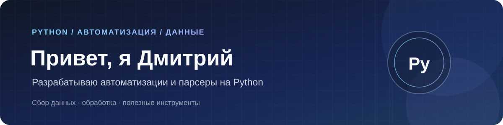

  

  
  
  
  
  

 

<table>
  <tr>
    <td width="50%"><strong>⚙️ Автоматизация</strong> Скрипты и инструменты для повторяющихся задач.</td>
    <td width="50%"><strong>🔎 Парсеры и данные</strong> Сбор, обработка и подготовка информации.</td>
  </tr>
  <tr>
    <td width="50%"><strong>🔗 Интеграции</strong> Связь сервисов и отдельных частей рабочего процесса.</td>
    <td width="50%"><strong>🐍 Основной инструмент</strong> Python — для практичных решений без лишней сложности.</td>
  </tr>
</table>

Делаю инструменты, которые освобождают время для более важных задач.

