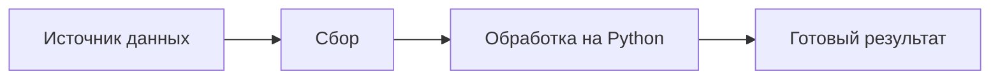

<h1>Привет! Я Дмитрий 👋</h1>

<strong>Python · автоматизация · парсинг данных</strong>

Создаю практичные инструменты, которые берут на себя рутинные задачи: 
собирают данные, обрабатывают их и помогают быстрее получать нужный результат.

  
  
  

---

## Чем занимаюсь

- **Автоматизация** — скрипты и небольшие инструменты для повторяющихся задач.
- **Парсинг и сбор данных** — получение информации из веб-источников и её подготовка к дальнейшей работе.
- **Обработка данных** — преобразование, проверка и формирование удобного результата.
- **Интеграции** — соединение отдельных инструментов и сервисов в понятный рабочий процесс.

## Как это обычно устроено

Стараюсь делать решения понятными и полезными в повседневной работе — без лишней сложности.
